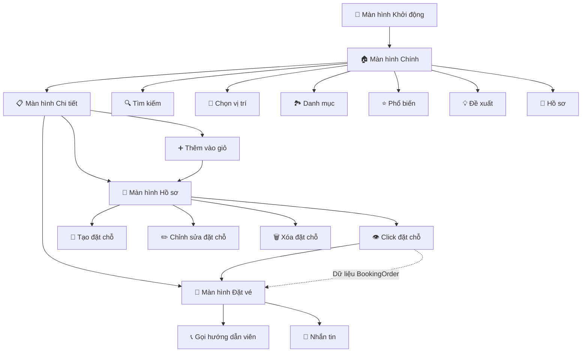
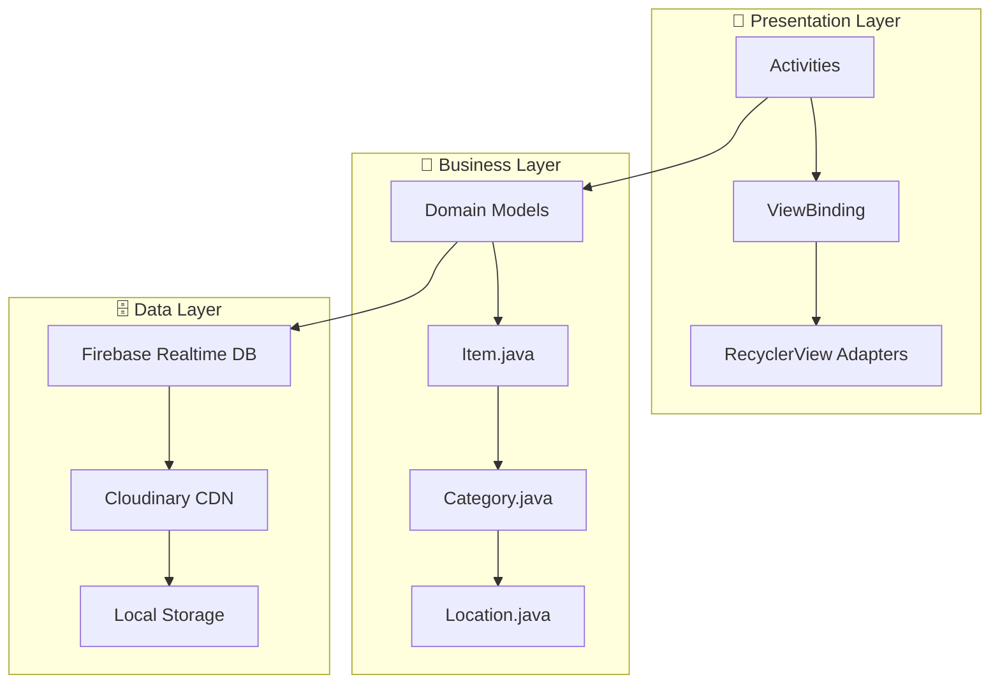
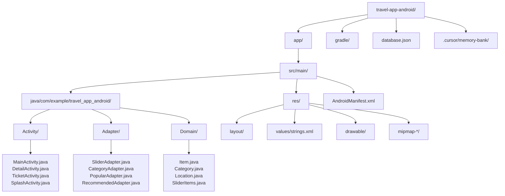
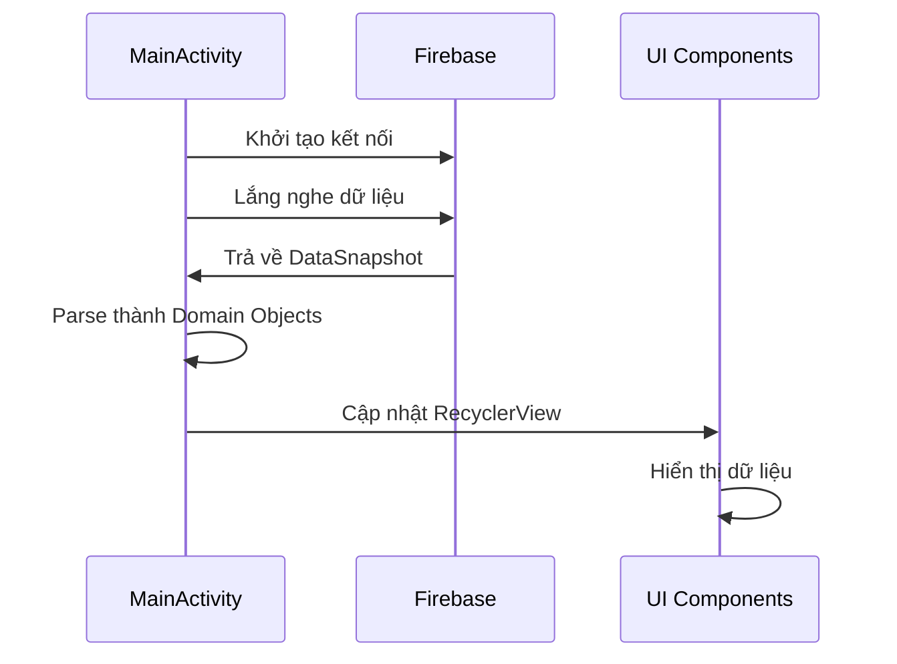
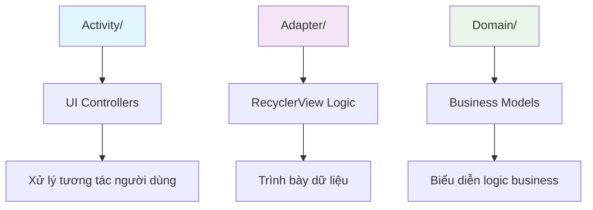
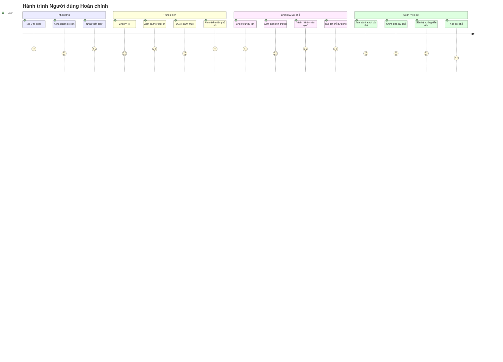
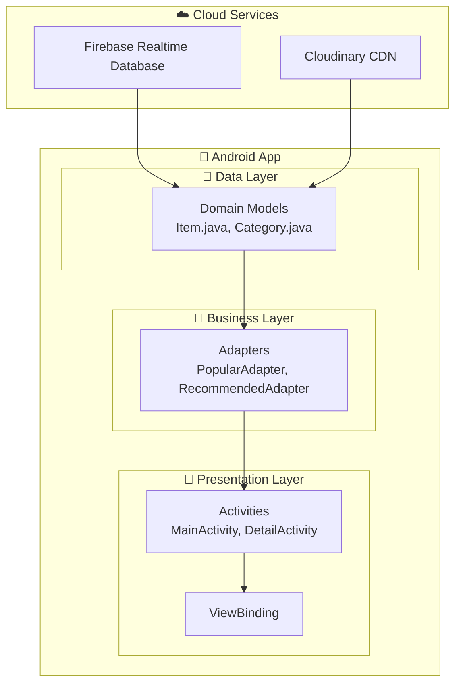

# 🌍 Ứng dụng Du lịch Android - Ứng dụng Đặt Tour Du lịch Bằng Tiếng Việt

> **Dự án Mobile Development Toàn diện cho Mục đích Giáo dục**  
> Một ứng dụng Android hoàn chỉnh về du lịch, minh họa các thực hành phát triển mobile hiện đại, tích hợp Firebase và quốc tế hóa.

## 📋 Mục lục
- [Tổng quan Dự án](#-tổng-quan-dự-án)
- [Mục tiêu Giáo dục](#-mục-tiêu-giáo-dục)
- [Công nghệ & Kiến trúc](#-công-nghệ--kiến-trúc)
- [Tính năng Đã triển khai](#-tính-năng-đã-triển-khai)
- [Hành trình Phát triển](#-hành-trình-phát-triển)
- [Cấu trúc Dự án](#-cấu-trúc-dự-án)
- [Hướng dẫn Cài đặt](#-hướng-dẫn-cài-đặt)
- [Điểm học tập Chính](#-điểm-học-tập-chính)
- [Screenshots & Demo](#-screenshots--demo)
- [Triển khai Kỹ thuật](#-triển-khai-kỹ-thuật)
- [Thử thách & Giải pháp](#-thử-thách--giải-pháp)
- [Cải tiến Tương lai](#-cải-tiến-tương-lai)
- [Đóng góp](#-đóng-góp)

## 🎯 Tổng quan Dự án

Đây là một **ứng dụng đặt tour du lịch hoàn chỉnh được bản địa hóa tiếng Việt** được xây dựng cho Android, thể hiện các thực hành phát triển mobile hiện đại và kiến trúc ứng dụng thực tế. Dự án minh họa một vòng đời phát triển đầy đủ từ thiết lập backend đến triển khai UI và quốc tế hóa.

### 🎓 Bối cảnh Giáo dục
Được phát triển như một ví dụ toàn diện cho khóa học **Cơ bản Phát triển Mobile**, dự án này bao gồm các khái niệm phát triển mobile thiết yếu bao gồm:
- Phát triển Android hiện đại với Java
- Tích hợp cơ sở dữ liệu thời gian thực Firebase
- Quản lý hình ảnh cloud với CDN
- Các mẫu thiết kế UI/UX chuyên nghiệp
- Quốc tế hóa và bản địa hóa
- Kiến trúc điều hướng
- ViewBinding và các thực hành Android hiện đại

### 🌟 Điều gì làm cho Dự án này Đặc biệt
- **Bộ tính năng Hoàn chỉnh**: Từ màn hình khởi động đến xác nhận đặt chỗ
- **Backend Thực tế**: Tích hợp Firebase với dữ liệu trực tiếp
- **UI Chuyên nghiệp**: Thiết kế hiện đại với nội dung du lịch xác thực
- **Bản địa hóa Tiếng Việt**: Thích ứng văn hóa đầy đủ cho thị trường Việt Nam
- **Giá trị Giáo dục**: Code sạch với documentation mở rộng

## 📊 Luồng Ứng dụng



## 📚 Mục tiêu Giáo dục

### Mục tiêu Học tập Chính
1. **Phát triển Android Hiện đại**: Học các thực hành phát triển Android hiện tại
2. **Tích hợp Backend**: Hiểu kết nối cơ sở dữ liệu thời gian thực
3. **Thiết kế UI/UX**: Triển khai giao diện mobile chuyên nghiệp
4. **Mẫu Điều hướng**: Thành thạo kiến trúc điều hướng Android
5. **Quốc tế hóa**: Học bản địa hóa ứng dụng cho thị trường toàn cầu
6. **Tổ chức Dự án**: Hiểu kiến trúc code sạch

### Kỹ năng Được minh họa
- **Lập trình Java**: Thiết kế hướng đối tượng trong bối cảnh mobile
- **Android SDK**: Kỹ thuật phát triển đặc thù nền tảng
- **Firebase**: Tích hợp backend cloud và dữ liệu thời gian thực
- **Gradle**: Hệ thống build hiện đại và quản lý dependency
- **Git**: Kiểm soát phiên bản và phát triển cộng tác
- **Documentation**: Documentation dự án chuyên nghiệp

## 🛠 Công nghệ & Kiến trúc

### 🏗️ Kiến trúc Hệ thống



### Công nghệ Cốt lõi
```
📱 Nền tảng: Android (API 21+)
💻 Ngôn ngữ: Java 21
🏗️ Hệ thống Build: Gradle (Kotlin DSL)
🎨 Framework UI: ViewBinding + ConstraintLayout
🗄️ Backend: Firebase Realtime Database
☁️ CDN: Cloudinary (Quản lý Hình ảnh)
🔧 IDE: Android Studio
```

### Mẫu Kiến trúc
```
📐 Kiến trúc: MVVM (Model-View-ViewModel) Sẵn sàng
📦 Cấu trúc Package: Tổ chức theo tính năng
🔄 Luồng Dữ liệu: Firebase → Domain Models → Adapters → UI
🎯 Điều hướng: Dựa trên Activity với điều hướng Intent
💾 Quản lý State: ViewBinding + Truyền dữ liệu Serializable
```

### Dependencies Chính
```gradle
// Firebase & Google Services
implementation 'com.google.firebase:firebase-database:21.0.0'
implementation 'com.google.gms:google-services:4.4.3'

// UI & Image Loading
implementation 'com.github.bumptech.glide:glide:4.16.0'
implementation 'com.github.ismaeldivita:chip-navigation-bar:1.4.0'
implementation 'androidx.viewpager2:viewpager2:1.0.0'

// ViewBinding & RecyclerView
implementation 'androidx.recyclerview:recyclerview:1.3.2'
viewBinding { enabled = true }
```

## ✨ Tính năng Đã triển khai

### 🏠 Tính năng Ứng dụng Cốt lõi
| Tính năng | Trạng thái | Mô tả |
|-----------|------------|-------|
| **Màn hình Khởi động** | ✅ Hoàn thành | Chào mừng tiếng Việt với chuyển đổi mượt mà |
| **Màn hình Chính** | ✅ Hoàn thành | Chọn vị trí, tìm kiếm, banner, danh mục |
| **Danh mục Du lịch** | ✅ Hoàn thành | Biển, Cắm trại, Rừng, Sa mạc, Núi |
| **Điểm đến Phổ biến** | ✅ Hoàn thành | Gói du lịch nổi bật với đánh giá |
| **Mục Đề xuất** | ✅ Hoàn thành | Gợi ý du lịch cá nhân hóa |
| **Màn hình Chi tiết** | ✅ Hoàn thành | Thông tin mục hoàn chỉnh với hình ảnh |
| **Màn hình Đặt chỗ** | ✅ Hoàn thành | Liên hệ hướng dẫn viên và chi tiết đặt chỗ |
| **Màn hình Hồ sơ** | ✅ Hoàn thành | Quản lý đặt chỗ với thiết kế hiện đại |
| **Hệ thống CRUD** | ✅ Hoàn thành | Tạo, đọc, cập nhật, xóa đặt chỗ |
| **Điều hướng Đặt chỗ** | ✅ Hoàn thành | Click đặt chỗ → mở màn hình vé chi tiết |
| **Luồng Điều hướng** | ✅ Hoàn thành | Hành trình người dùng hoàn chỉnh 4 màn hình |

### 🌍 Tính năng Bản địa hóa
| Thành phần | Trạng thái Tiếng Việt | Triển khai |
|------------|----------------------|------------|
| **Nhãn UI** | ✅ Hoàn thành | Bản dịch tiếng Việt chuyên nghiệp |
| **Nội dung Du lịch** | ✅ Hoàn thành | Mô tả tiếng Việt xác thực |
| **Danh mục** | ✅ Hoàn thành | Đặt tên phù hợp văn hóa |
| **Ngày & Thời lượng** | ✅ Hoàn thành | Định dạng tiếng Việt + ký hiệu compact |
| **Thông báo Lỗi** | ✅ Hoàn thành | Văn bản tiếng Việt thân thiện người dùng |

### 📱 Hệ thống Quản lý Đặt chỗ (CRUD)
| Chức năng | Trạng thái | Mô tả chi tiết |
|-----------|------------|----------------|
| **Tạo Đặt chỗ (Create)** | ✅ Hoàn thành | Nút "Thêm vào giỏ" từ màn hình chi tiết → tự động tạo đặt chỗ |
| **Xem Đặt chỗ (Read)** | ✅ Hoàn thành | Hiển thị danh sách đặt chỗ với cập nhật thời gian thực |
| **Cập nhật Đặt chỗ (Update)** | ✅ Hoàn thành | Chỉnh sửa số khách, ngày tour, trạng thái thanh toán |
| **Xóa Đặt chỗ (Delete)** | ✅ Hoàn thành | Xóa đặt chỗ với hộp thoại xác nhận |
| **Thiết kế Hiện đại** | ✅ Hoàn thành | Card style với góc bo tròn và shadow |
| **Trạng thái Trực quan** | ✅ Hoàn thành | Màu sắc và nhãn cho trạng thái đặt chỗ và thanh toán |
| **Điều hướng Tích hợp** | ✅ Hoàn thành | Click đặt chỗ → mở TicketActivity với thông tin đầy đủ |

### 🔧 Tính năng Kỹ thuật
| Tính năng | Trạng thái | Chi tiết Triển khai |
|-----------|------------|-------------------|
| **ViewBinding** | ✅ Hoàn thành | Truy cập view type-safe trên tất cả màn hình |
| **Tích hợp Firebase** | ✅ Hoàn thành | Tải dữ liệu thời gian thực với chỉ báo tiến trình |
| **Tải Hình ảnh** | ✅ Hoàn thành | CDN Cloudinary tối ưu với cache Glide |
| **Điều hướng** | ✅ Hoàn thành | Điều hướng dựa Intent với truyền dữ liệu |
| **Giao tiếp** | ✅ Hoàn thành | Tích hợp SMS và điện thoại cho đặt chỗ |
| **Thiết kế Responsive** | ✅ Hoàn thành | Hỗ trợ icon đa mật độ |
| **Firebase Security** | ✅ Hoàn thành | Quy tắc bảo mật cho phép thao tác CRUD |


## 📁 Cấu trúc Dự án

### 🗂️ Tổ chức File



```
travel-app-android/
├── app/
│   ├── src/main/
│   │   ├── java/com/example/travel_app_android/
│   │   │   ├── Activity/              # Tất cả activities ứng dụng
│   │   │   │   ├── SplashActivity.java    # Màn hình chào mừng
│   │   │   │   ├── MainActivity.java      # Màn hình chính với Firebase
│   │   │   │   ├── DetailActivity.java    # Màn hình chi tiết mục
│   │   │   │   └── TicketActivity.java    # Màn hình đặt chỗ
│   │   │   ├── Adapter/               # Adapters RecyclerView
│   │   │   │   ├── SliderAdapter.java     # Banner ViewPager2
│   │   │   │   ├── CategoryAdapter.java   # RecyclerView danh mục
│   │   │   │   ├── PopularAdapter.java    # Mục phổ biến với điều hướng
│   │   │   │   └── RecommendedAdapter.java # Mục đề xuất
│   │   │   └── Domain/                # Models dữ liệu
│   │   │       ├── Location.java         # Dữ liệu spinner vị trí
│   │   │       ├── SliderItems.java      # Hình ảnh banner
│   │   │       ├── Category.java         # Danh mục du lịch
│   │   │       └── Item.java             # Model mục du lịch hoàn chỉnh
│   │   ├── res/
│   │   │   ├── layout/                # Layouts XML với ViewBinding
│   │   │   ├── values/strings.xml     # Bản địa hóa tiếng Việt
│   │   │   ├── drawable/              # Đồ họa UI và backgrounds
│   │   │   └── mipmap-*/              # Icons ứng dụng đa mật độ
│   │   └── AndroidManifest.xml        # Cấu hình ứng dụng
│   ├── build.gradle.kts               # Cấu hình build cấp ứng dụng
│   └── google-services.json           # Cấu hình Firebase
├── gradle/
│   └── libs.versions.toml             # Quản lý dependency tập trung
├── database.json                      # Cấu trúc cơ sở dữ liệu Firebase
└── .cursor/memory-bank/              # Documentation dự án
    ├── projectbrief.md               # Tổng quan dự án
    ├── activeContext.md              # Trạng thái phát triển hiện tại
    ├── progress.md                   # Tiến trình triển khai
    ├── systemPatterns.md             # Quyết định kiến trúc
    ├── techContext.md                # Lựa chọn công nghệ
    └── productContext.md             # Yêu cầu sản phẩm
```

## 🚀 Hướng dẫn Cài đặt

### Điều kiện Tiên quyết
```bash
# Phần mềm Yêu cầu
- Android Studio (Phiên bản mới nhất)
- Java 21 JDK
- Git cho kiểm soát phiên bản
- Thiết bị Android thật hoặc emulator (API 21+)
```

### Các bước Cài đặt

#### 1. Clone Repository
```bash
git clone https://github.com/holdennguyen/travel-app-android.git
cd travel-app-android
```

#### 2. Thiết lập Firebase
```bash
# Cấu hình Firebase đã được bao gồm
# URL Database: https://travel-app-android-73928-default-rtdb.asia-southeast1.firebasedatabase.app/
# google-services.json đã được cấu hình

# ⚠️ QUAN TRỌNG: Cấu hình Firebase Security Rules
# Vào Firebase Console → Realtime Database → Rules
# Sao chép nội dung từ firebase-security-rules-demo.json
# Và nhấn "Publish" để cho phép thao tác CRUD trên Bookings
```

#### 3. Thiết lập Android Studio
```bash
# 1. Mở dự án trong Android Studio
# 2. Để Gradle sync hoàn thành
# 3. Chọn thiết bị/emulator phù hợp
# 4. Build và chạy ứng dụng
```

#### 4. Lệnh Build
```bash
# Clean build
./gradlew clean

# Debug build
./gradlew assembleDebug

# Chạy tests
./gradlew test
```

### 🔧 Khắc phục Sự cố
```bash
# Vấn đề Thường gặp:
1. Gradle sync thất bại → Kiểm tra kết nối internet và phiên bản Gradle
2. Vấn đề kết nối Firebase → Xác minh vị trí google-services.json
3. Lỗi ViewBinding → Clean và rebuild dự án
4. Vấn đề tải hình ảnh → Kiểm tra quyền internet trong manifest
```

## 🎓 Điểm học tập Chính

### 1. Phát triển Android Hiện đại
```java
// Ví dụ ViewBinding - Truy cập view type-safe
public class MainActivity extends AppCompatActivity {
    private ActivityMainBinding binding;
    
    @Override
    protected void onCreate(Bundle savedInstanceState) {
        super.onCreate(savedInstanceState);
        binding = ActivityMainBinding.inflate(getLayoutInflater());
        setContentView(binding.getRoot());
        
        // Truy cập type-safe đến views
        binding.searchButton.setOnClickListener(v -> performSearch());
    }
}
```

### 2. Tích hợp Firebase Real-time



```java
// Mẫu Tải dữ liệu Firebase
private void initPopular() {
    DatabaseReference myref = database.getReference("Popular");
    ArrayList<Item> list = new ArrayList<>();
    
    myref.addListenerForSingleValueEvent(new ValueEventListener() {
        @Override
        public void onDataChange(@NonNull DataSnapshot snapshot) {
            if(snapshot.exists()) {
                for(DataSnapshot issue : snapshot.getChildren()) {
                    list.add(issue.getValue(Item.class));
                }
                setupRecyclerView(list);
                binding.progressBarPopular.setVisibility(View.GONE);
            }
        }
        
        @Override
        public void onCancelled(@NonNull DatabaseError error) {
            Log.e(TAG, "Lỗi Firebase: " + error.getMessage());
        }
    });
}
```

### 3. RecyclerView với Điều hướng
```java
// Adapter với Mẫu Điều hướng
@Override
public void onBindViewHolder(@NonNull Viewholder holder, int position) {
    // Data binding
    binding.titleTxt.setText(items.get(position).getTitle());
    binding.priceTxt.setText("$" + items.get(position).getPrice());
    
    // Tải hình ảnh với Glide
    Glide.with(context)
        .load(items.get(position).getPic())
        .into(binding.pic);
    
    // Điều hướng với truyền dữ liệu
    holder.itemView.setOnClickListener(view -> {
        Intent intent = new Intent(context, DetailActivity.class);
        intent.putExtra("object", items.get(position));
        context.startActivity(intent);
    });
}
```

### 4. Mẫu Quốc tế hóa
```xml
<!-- strings.xml - Bản địa hóa Tiếng Việt -->
<resources>
    <string name="app_name">Ứng dụng Du lịch</string>
    <string name="search">Tìm kiếm</string>
    <string name="popular_destination">Điểm đến phổ biến</string>
    <string name="splash_title">Khám phá thế giới\ncùng với chúng tôi</string>
</resources>
```

### 5. Tổ chức Kiến trúc Sạch



```java
// Lợi ích Cấu trúc Package:
com.example.travel_app_android/
├── Activity/    # UI Controllers - Xử lý tương tác người dùng
├── Adapter/     # Logic RecyclerView - Trình bày dữ liệu
└── Domain/      # Data Models - Biểu diễn logic business

// Sự phân tách này cung cấp:
- Tổ chức code có thể bảo trì
- Phân tách trách nhiệm rõ ràng
- Testing và debugging dễ dàng
- Nền tảng kiến trúc có thể mở rộng
```

## 📱 Screenshots & Demo

### 🎯 Hệ thống Đặt chỗ Hoàn chỉnh

#### **Luồng Đặt chỗ Mới:**
```
1. 🏠 Trang chủ → Chọn tour phổ biến/đề xuất
2. 📋 Màn hình chi tiết → Xem thông tin đầy đủ
3. ➕ Nhấn "Thêm vào giỏ" → Tự động tạo đặt chỗ
4. 👤 Chuyển đến hồ sơ → Xem đặt chỗ mới tạo
5. ✏️ Quản lý đặt chỗ → Chỉnh sửa/Xóa theo nhu cầu
```

#### **Tính năng Hồ sơ:**
- **📊 Dashboard**: Thông tin người dùng và tổng số đặt chỗ
- **📋 Danh sách Đặt chỗ**: Hiển thị theo thời gian (mới nhất trước)
- **🎨 Thiết kế Hiện đại**: Card style với hình ảnh bo góc tròn
- **⚡ Thao tác Nhanh**: Menu popup với tùy chọn sửa/xóa
- **🔄 Cập nhật Thời gian thực**: Firebase sync tự động

### Luồng Ứng dụng



```
🚀 Màn hình Splash → 🏠 Màn hình Chính → 📋 Màn hình Chi tiết → 🎫 Màn hình Đặt chỗ
     ↓               ↓               ↓               ↓
Tiêu đề Tiếng Việt   Dữ liệu Firebase   Thông tin Hoàn chỉnh   Liên hệ Hướng dẫn viên
Animation Tải       Tải Thời gian thực   Thư viện Hình ảnh   Tích hợp SMS/Phone
Giới thiệu Thương hiệu  Mục Danh mục      Hệ thống Đánh giá    Chi tiết Đặt chỗ
```

### Các phần tử UI Chính
- **Thiết kế Hiện đại**: Màu tím/xanh với UI tập trung du lịch
- **Hình ảnh Chuyên nghiệp**: Tích hợp CDN Cloudinary cho tải tối ưu
- **Nội dung Tiếng Việt**: Mô tả thích ứng văn hóa và văn bản UI
- **Layout Responsive**: Hỗ trợ đa mật độ cho tất cả thiết bị Android
- **Trạng thái Tải**: Chỉ báo tiến trình chuyên nghiệp trong khi tải dữ liệu

## 🔧 Triển khai Kỹ thuật

### Kiến trúc Tích hợp Firebase



### Mẫu Luồng Dữ liệu
```java
// Mẫu nhất quán trên tất cả sections:
1. Firebase Reference → 2. ValueEventListener → 3. Domain Model → 4. Adapter → 5. UI Display

// Ví dụ luồng:
database.getReference("Popular") 
→ ValueEventListener.onDataChange() 
→ Item.class objects 
→ PopularAdapter 
→ RecyclerView display
```

### Lợi ích ViewBinding
```java
// Trước ViewBinding (findViewById):
TextView titleText = findViewById(R.id.titleTxt);
Button searchButton = findViewById(R.id.searchBtn);
// Rủi ro: Runtime crashes nếu ID không tồn tại

// Với ViewBinding:
binding.titleTxt.setText("Title");
binding.searchBtn.setOnClickListener(v -> search());
// Lợi ích: Compile-time safety, null safety, performance
```

## 🎯 Thử thách & Giải pháp

### 1. Vấn đề Kết nối Firebase
**Thử thách**: Location spinner thất bại tải dữ liệu từ Firebase  
**Giải pháp**: 
- Sửa case sensitivity trong field mapping (`Loc` → `loc`)
- Thêm quyền internet trong AndroidManifest
- Cấu hình URL database rõ ràng cho tối ưu khu vực

### 2. Lỗi Biên dịch ViewBinding
**Thử thách**: Không tìm thấy class `ViewholderRecommendedBinding`  
**Giải pháp**: Sửa lỗi chính tả tên file layout (`viewholer_recommended.xml` → `viewholder_recommended.xml`)

### 3. Bản địa hóa Tiếng Việt
**Thử thách**: Tạo nội dung tiếng Việt xác thực vs. dịch theo nghĩa đen  
**Giải pháp**: 
- Thích ứng văn hóa thay vì dịch trực tiếp
- Mô tả du lịch xác thực cho khán giả Việt Nam
- Định dạng thời lượng compact cho tối ưu mobile

### 4. Truyền Dữ liệu Điều hướng
**Thử thách**: Truyền dữ liệu mục du lịch phức tạp giữa các activities  
**Giải pháp**: 
- Triển khai interface Serializable trong model Item
- Sử dụng Intent.putExtra() cho truyền dữ liệu
- Lấy dữ liệu type-safe trong destination activities

### 5. Điều hướng Đặt chỗ Thống nhất
**Thử thách**: TicketActivity cần hỗ trợ cả dữ liệu Item (từ DetailActivity) và BookingOrder (từ ProfileActivity)  
**Giải pháp**: 
- Thêm logic phát hiện loại dữ liệu trong getIntentExtra()
- Triển khai createItemFromBooking() để chuyển đổi BookingOrder → Item
- Sửa đổi BookingAdapter để điều hướng trực tiếp thay vì hiển thị dialog
- Loại bỏ interface không sử dụng để giữ code sạch

## 🚀 Cải tiến Tương lai

### Cải thiện Ngay lập tức
- [ ] **Repository Pattern**: Lớp trừu tượng truy cập Firebase
- [ ] **ViewModel Integration**: Triển khai kiến trúc MVVM với LiveData
- [ ] **Chức năng Tìm kiếm**: Thêm tìm kiếm dựa query Firebase
- [ ] **Xử lý Lỗi**: Quản lý lỗi mạng toàn diện
- [ ] **Testing**: Unit và integration tests

### Tính năng Nâng cao
- [ ] **User Authentication**: Tích hợp Firebase Auth
- [ ] **Hỗ trợ Offline**: Cache cơ sở dữ liệu local
- [ ] **Push Notifications**: Firebase Cloud Messaging
- [ ] **Tích hợp Payment**: Hệ thống thanh toán đặt chỗ
- [ ] **Tích hợp Maps**: Google Maps cho hiển thị vị trí

### Tối ưu Performance
- [ ] **Tối ưu Hình ảnh**: Cấu hình Glide nâng cao
- [ ] **Quản lý Memory**: Tối ưu performance RecyclerView
- [ ] **Tối ưu Network**: Triển khai strategies caching
- [ ] **Animation**: Chuyển đổi mượt và micro-interactions

## 📚 Giá trị Giáo dục

### Cho Sinh viên Phát triển Mobile
1. **Dự án Thực tế**: Ứng dụng hoàn chỉnh từ concept đến deployment
2. **Thực hành Hiện đại**: Tiêu chuẩn phát triển Android hiện tại
3. **Kinh nghiệm Tích hợp Backend**: Trải nghiệm kết nối cơ sở dữ liệu trực tiếp
4. **Thiết kế UI/UX**: Thiết kế giao diện mobile chuyên nghiệp
5. **Quốc tế hóa**: Cân nhắc phát triển ứng dụng toàn cầu
6. **Giải quyết Vấn đề**: Thử thách debugging và tối ưu thực tế

### Kết quả Học tập
- **Kỹ năng Kỹ thuật**: Java, Android SDK, Firebase, Gradle
- **Tư duy Kiến trúc**: Tổ chức code sạch và patterns
- **Trải nghiệm Người dùng**: Cân nhắc thiết kế mobile-first
- **Phát triển Toàn cầu**: Bản địa hóa và thích ứng văn hóa
- **Phát triển Chuyên nghiệp**: Documentation và quản lý dự án

## 🤝 Đóng góp

### Cho Sinh viên
Dự án này phục vụ như một ví dụ giáo dục. Sinh viên có thể:
- Nghiên cứu cấu trúc code và patterns
- Thử nghiệm với việc thêm tính năng
- Luyện tập debugging và tối ưu
- Học các thực hành phát triển Android hiện đại

### Hướng dẫn Phát triển
```bash
# Code Style
- Tuân theo quy ước coding Android
- Sử dụng tên biến và method có ý nghĩa
- Thêm comments cho logic phức tạp
- Duy trì formatting nhất quán

# Git Workflow
- Tạo feature branches cho phát triển mới
- Viết commit messages mô tả
- Cập nhật documentation với thay đổi
- Test kỹ lưỡng trước khi commit
```

## 📝 License & Sử dụng Học thuật

Dự án này được phát triển cho **mục đích giáo dục** và phục vụ như một ví dụ toàn diện cho các khóa học phát triển mobile. Sinh viên và giáo viên được khuyến khích:

- Sử dụng dự án này như tài liệu tham khảo để học
- Thích ứng các khái niệm cho dự án riêng của họ
- Nghiên cứu các patterns và kiến trúc triển khai
- Xây dựng dựa trên nền tảng này cho các tính năng nâng cao

---

## 🎉 **Ứng dụng Hoàn chỉnh - Sẵn sàng Sử dụng!**

### **✅ Tính năng Đã hoàn thành:**
- **🏠 Duyệt Tour**: Trang chủ với banner, danh mục, điểm đến phổ biến
- **📋 Chi tiết Tour**: Thông tin đầy đủ với hình ảnh và đánh giá
- **🎫 Liên hệ HDV**: SMS và gọi điện trực tiếp đến hướng dẫn viên
- **➕ Đặt chỗ Nhanh**: Nút "Thêm vào giỏ" tạo đặt chỗ tự động
- **👤 Quản lý Hồ sơ**: CRUD đầy đủ với thiết kế hiện đại
- **🌍 Giao diện Tiếng Việt**: Hoàn toàn bản địa hóa và thân thiện

### **🚀 Sẵn sàng để:**
- **📱 Demo**: Trình bày cho lớp học hoặc khách hàng
- **🧪 Testing**: Kiểm thử đầy đủ tất cả tính năng
- **🔧 Mở rộng**: Thêm authentication, payment, maps
- **🏭 Production**: Deploy với Firebase thực tế

**📱 Sẵn sàng khám phá phát triển mobile? Clone repository này và trải nghiệm ứng dụng du lịch hoàn chỉnh với hệ thống đặt chỗ chuyên nghiệp!**

*Dự án này chứng minh rằng với kế hoạch phù hợp, công cụ hiện đại và kiến trúc tốt, sinh viên có thể xây dựng ứng dụng mobile chất lượng production với đầy đủ tính năng CRUD và giao diện người dùng chuyên nghiệp.* 